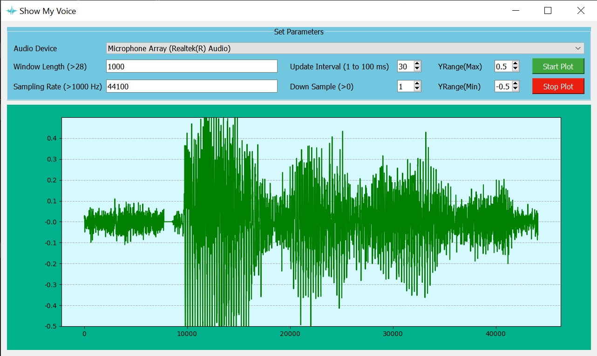

<h1 align="center">
<br>
    ~ Show My Voice ~
</h1>


<h3 align="center">An Audio Visualizer made in PyQt5</h3>
<br>

## Features

- Quick and efficient with minimal and simple UI

- Allows users to alter parameters like Window Length, Sampling Rate, Update Interval, Downsample and Y-Range


## Setup and Running the Program

To install the package and all dependencies:

```
git clone https://github.com/mehulsinha73/Show-My-Voice.git
conda create -n voice requirements.txt
conda activate voice
python voice.py
```

<br>

## Demo
<br>

<br>
<br>



